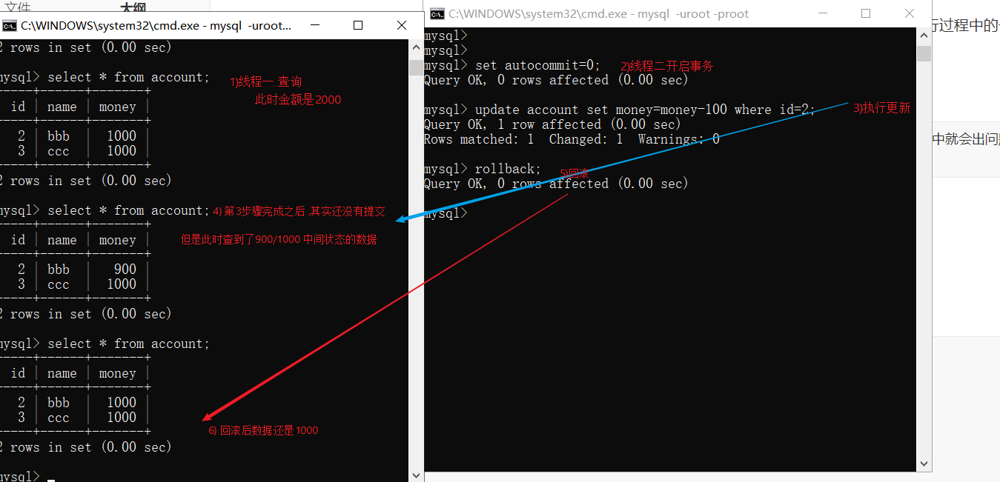
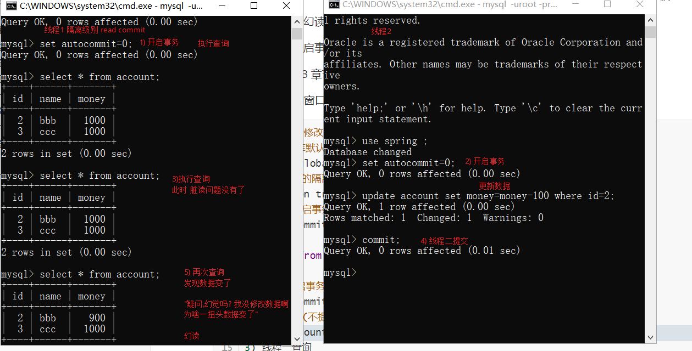
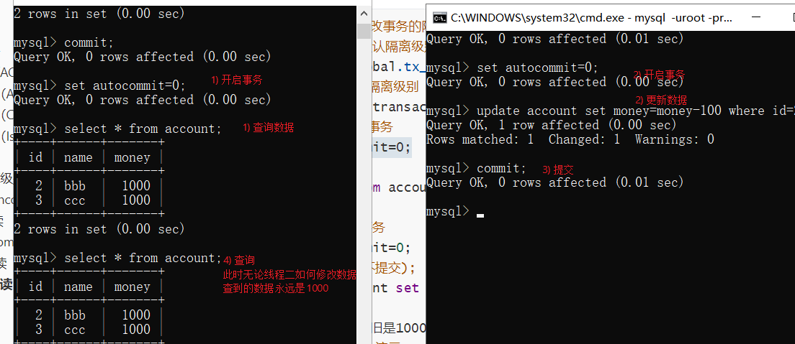
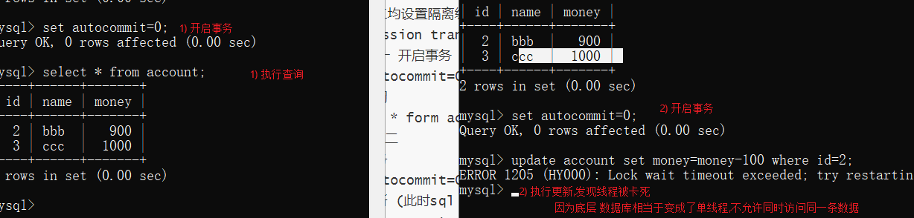

#mysql 事务

## 1) 什么是事务

​	张三和李四分别有多少钱作为一个系统来讲我们肯定要把数据存储到数据库中,我们作为一个开发人员需要一个"数据库软件"来存储我们的数据. 那这个数据应该具备什么个性

​	"必须保证我提交的数据同时成功同时失败", 例如张三给李四转账入,必须张三扣除500块和李四增加500块同时成功,或者同时失败,数据库必须具备这个特性,否则这个数据库软件我们作为开发人员是不会选中的,这个特性就叫做事务

​	其实现有的数据库软件都具备这个特性

## 2) 事务的特征ACID

   事务有四大特征**（ACID）**

### 2.1)**原子性**（Atomicity）

> 原子性指的是一个业务中所有的指令和sql 必须同时成功同时失败

 这一点和上面介绍什么是事务的时候讲的是一样的,实际上"同时成功和失败"只是事务的其中一个特性

```
例如:
	张三给李四转账我们发送了两条sql 语句
	update account set money=money-100 where id='zhangsan';
	update account set money=money+100 where id='lisi';

```

当开启事务时,数据库保证同时成功同时失败,这个特性就是原子性

讲到这里可能同学们对什么是"原子" 有疑惑

​	在化学上("原子")时不可分割的最小单位, 而上述两条sql 语句 是转账 业务中不可分割的两个东西;如果在开启事务的情况下.数据库底层,分割开分别执行就会出现问题,

```sql
mysql数据库提供了几个个指令 来保证这个操作
set autocommit=0;-- 开启事务
commit;--提交事务
rollback;--回滚事务
```

### 2.2)**一致性**（Consistency）

> 一致性指数据库软件必须保证呈现给查询语句的结果和我们对数据的预期一致

```
例如
	张三李四各有1000块,张三给李四转100账我们发送了两条sql 语句
	update account set money=money-100 where id='zhangsan';
	update account set money=money+100 where id='lisi';
```

cpu 是按照指令从上到下执行的,不可能同时执行两件事,所以上面的两条sql 语句,数据库底层在执行时有先后顺序的,问题来了,多线程环境下 
 	1)线程一转账,如果数据库执行完第一条sql,线程暂停了(此时内存中张三的钱是900,李四的是1000)
	 2)此时第二个线程查询,数据库必须保证查询的结果 是张三和李四的钱加起来是两千,不能是1900
 此时数据库必须具备如下功能
			要么给线程二的数据 是(张三1000,李四1000), 要么等待线程一执行完讲结果(张三900,李四1100) 返回,不能讲 内存中间状态(张三的钱是900,李四的是1000) 返回. 因为线程二预期是账户加起来是2000块
数据库具备的这种特性叫做 一致性

网上很多帖子解释的是结果必须是2000.叫一致性,其实解析的有问题

比如我们的业务就是:"张三给李四转100,但是系统要收取1块钱手续费" 难道转账完毕 结果变成1999就不是一致性了吗?

显然不是,数据库查询的结果和我们业务预期是一致的,就叫做事务的一致性

### 2.3)**隔离性**（Isolation）

> 隔离性是多线程环境下，比如操作同一张表时，数据库为每一个用户开启的事务，不能被其他事务的操作所干扰，多个并发事务之间要相互隔离。

```
数据库软件应该保证如下操作没问题
	比如T1(张三给李四转账),T2(王五给李四账), 两个业务互不影响,要保证要么T1 先执行等结束了在执行T2,要么反过来,两个操作无不影响,并且不影响结果
数据库的这种特性叫做隔离性
```

### 2.4)持久性

​	数据库必须保证数据是永久的,它对于数据的改变是永久性的,例如系统重启必须保重数据还是存在的.

## 3) 事务的隔离级别

上述四个特性是数据库软件默认支持的特性,但是数据库提供了一些配置我们可以破坏上述特性

数据库提供了一个配置我们叫做隔离级别,共有四个,我们可以修改配置破坏或者改变上述规则在执行过程中的一些细节

### 3.1) **Read uncommitted** 读未提交

```
如果我们把数据库默认的隔离级别改为 这个则会破坏我们上述四个特征中的一致性,此时一致性的案例中就会出问题
即多线程环境下,我们能查询到"内存中临时的数据" (脏读)
```

案例(不要使用sql yong 等工具,直接使用黑窗口)

```sql
开启mysql 两个窗口,演示两个线程并发
提前准备好一个数据库表 account
1) 窗口一操作
--查询数据库默认隔离级别
select @@global.tx_isolation,@@tx_isolation;
-- 修改事务的隔离级别 为 Read uncommitted  读未提交
set session transaction isolation level read uncommitted;
-- 查询表
select * from account;
2) 窗口二操作
-- 开启事务
set autocommit=0;
-- 更新事务
update account set money=money-100 where id=2;
3) 窗口一操作
-- 查询表 此时看到了未提交的数据
select * from account;
4) 窗口二操作回滚
rollback;
5)窗口一操作查询,此时数据还是2000
select * from account;
```



#### 3.1.2)脏读

​	第四步这种现象叫做读脏读,数据不是最终的数据,可能会被修改回退

### 3.2) Read committed 读已提交

oracle 数据库默认,这种隔离级别不会破坏上述事务四大特性中的任何一个,即上述脏读的问题被解决了

,但是有一个现象叫幻读

多线程环境下,当开启事务后

下属案例请 结合3.3 章节对比学习

(请讲上述案例中的窗口关闭重新打开,否则可能会不生效)

```sql
--1) 线程一修改事务的隔离级别
--查询数据库默认隔离级别
select @@global.tx_isolation,@@tx_isolation;
-- 修改事务的隔离级别 为 Read committed  读已提交
set session transaction isolation level read committed;
--线程一 开启事务
set autocommit=0;
-- 查询表 
select * from account;
--2)
--线程二开启事务
set autocommit=0;
-- 更新数据(不提交);
update account set money=money-100 where id=2;
3) 线程一查询
此时查询到的依旧是1000/1000 数据并未发生变化(脏读问题被解决了)
--------继续:演示新的问题---------------
4)此时线程一准备更新操作(是准备)并不执行
-- 查询表 得到的是1000
select * from account;
5) 但是同时线程二提交了(commit)数据(线程一还没有更新)
update account set money=money-100 where id=2;
commit;
6)线程一的开发人员不知道线程二修改了数据,有查询了一次(此时看到的是900)
-- 查询表 得到的是900
select * from account;
此时线程一的开发人员就会有疑惑
	"不对啊,幻觉吗,刚才明明是1000,怎么过了这么一会儿数据就变了呢,我没改啊?"
```



#### 3.2.1) 幻读,不可重复读

```
上述的这种现象叫做幻读,也叫做不可重复读
```

### 3.3) 可重复读 Repeatable Read

mysql 默认

如果设置未这个级别上述案例中线程1的的疑问将不会存在,即如果线程一开启了事务,则不管其他线程如何修改数据,线程一看到的数据永远一致

```sql
--1) 线程一修改事务的隔离级别
--查询数据库默认隔离级别
select @@global.tx_isolation,@@tx_isolation;
-- 修改事务的隔离级别 为 Repeatable Read  读已提交 (默认无需设置)
set session transaction isolation level repeatable read;
--线程一 开启事务
set autocommit=0;
-- 查询表 
select * from account;
--2)
--线程二开启事务
set autocommit=0;
-- 更新数据(不提交);
update account set money=money-100 where id=2;
3) 线程一查询
此时查询到的依旧是1000/1000 数据并未发生变化(脏读问题被解决了)
--------继续:演示---------------
4)此时线程一准备更新操作(是准备)并不执行
-- 查询表 得到的是1000
select * from account;
5) 但是同时线程二提交了(commit)数据(线程一还没有更新)
update account set money=money-100 where id=2;
commit;
6)线程一的开发人员不知道线程二修改了数据,有查询了一次(此时看到的是1000)
-- 查询表 得到的是1000 幻读问题解决了
select * from account;
```



这种现象叫可重复读

### 3.4) Serializable（可串行化） 

\这是最高的隔离级别，它通过强制事务排序，使之不可能相互冲突，从而解决幻读问题。

虽然Serializable隔离级别下的事务具有最高的安全性，但是，由于事务是串行执行，所以效率会大大下降

```sql
线程一二均设置隔离级别
set session transaction isolation level serializable;
--线程一 开启事务
set autocommit=0;
执行查询
select * form account;
-- 线程二
开启事务
set autocommit=0;
执行更新 (此时sql 卡住不动了)
update account set money=money-100 where id=2;

```

